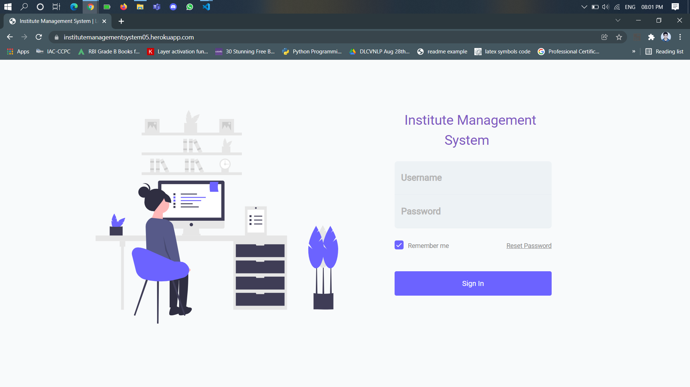
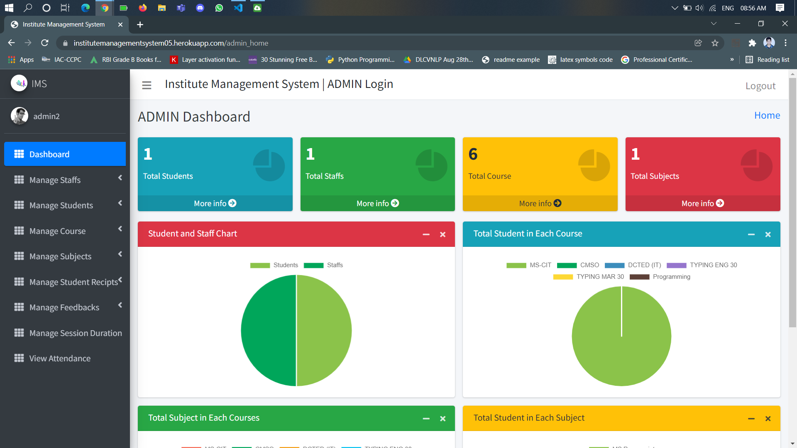
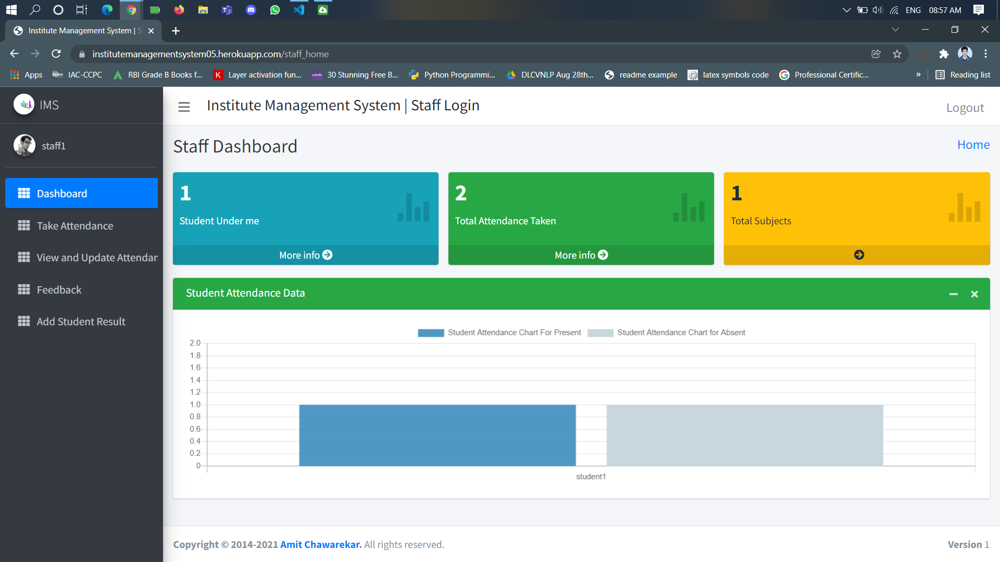
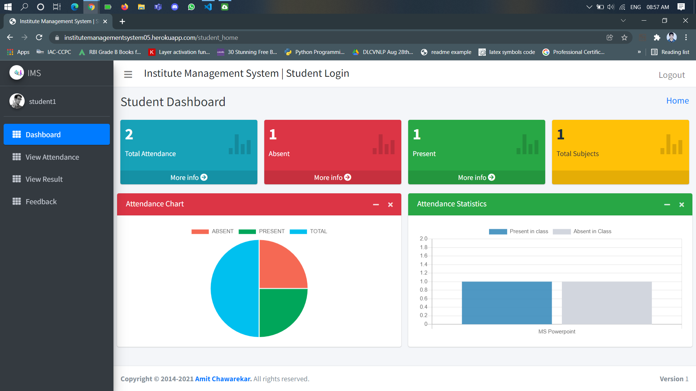

# INSTITUTE MANAGEMENT SYSTEM

Institute Management System is a Web Application designed using Django Framework.
Any Educational Institute can use this project for Student and Staff Management of their Institute. 


## Table of Contents

- [Brief Description](#BriefDescription)
- [Features](#Features)
- [DeploymentLink](#Deployment)
- [Acknowlegements](#Acknowlegements)
- [License](#License)
- [Lessons](#Lessons)
- [RunLocally](#RunLocally)
- [Screenshots](#Screenshots)
## Brief Description

Institute Management System is a web application using various Frameworks and Technologies:

- Django Framework
- HyperText Markup Language (HTML)
- Ajax
- Jquery
- MySQL(database) for backend
- CSS
- JavaScript

This Project has 3 Panels (Admin Panel, Staff Panel, Student Panel).

### Admin Panel Features:
- Managing Staff (Add and Update Staff Data)
- Managing Student (Add and Update Student Data)
- Managing Course (Add and Update Course Data)
- Managing Subjects (Add and Update Subjects Data)
- Managing Student Recipts
- View Student Attendance Data
- Managing Student and Staff Feebacks ( Replying the Feedbacks)
- Update Own Profile

### Staff Panel Features:
- Take Student Attendance 
- View And Update Student Attendance
- Give Feedback to Admin 
- Add Student Result
- Update Own Profile

### Student Panel Features:
- View Own Attendance
- View Own Result for respective Subjects
- Give Feedback to Admin
- Update Own Profile


## Features

- Student Attendance Management Functionality
- Student Result Management Functionality
- Student Fee Recipt Management Functionality

## Deployment 
I have deployed this project on heroku with sqlite3 database

Link :- 
[IMS](https://institutemanagementsystem05.herokuapp.com/)

Deployed Code Repo link :- 
[IMS_heroku](https://github.com/Amitchawarekar/IMS_heroku)


## Acknowledgements

 - [AdminLTE3 Dashboard](https://adminlte.io/themes/v3/)
 - [StackOverFlow](https://stackoverflow.com/questions/6498373/getting-started-with-python-and-django/)
 - [W3cschools](https://www.w3schools.com/jquERy/default.asp)
 - [youtube](https://www.youtube.com/)
## License

[GNU General Public License](https://www.gnu.org/licenses/gpl-3.0.en.html)


## Lessons Learned

While Building this project I Learned 
- how to create a web application using django framework,
- ajax,jquery apllications in django project
- how to use bootstrap

### Challenges Faced
I faced many errors while creating this project but I learned 
how to solve those by doing research and I overcome the challenge.


## Run Locally

- Clone the project

```bash
  git clone https://link-to-project
```

- Go to the project directory

```bash
  cd my-project
```
- Create Virtual Enviornment

```bash
  conda create -n envname python=="version" -y
```

- Install dependencies

```bash
  pip install -r requirements.txt
```

- Create a database IMS in MySQL
- Start Django project and create App in it

- Run These commands 
```bash
  python manage.py makemigrations "Appname"
  python manage.py migrate
```
- Create SuperUser
```bash
  python manage.py createsuperuser
```
- Run the Django Project

```bash
 python manage.py runserver
```


## Screenshots

<h4>Login Page</h4>


<h4>Admin Home Page</h4>


<h4>Staff Home Page</h4>


<h4>Student Home Page</h4>



